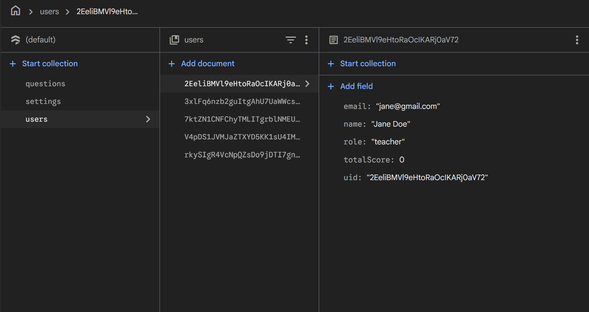
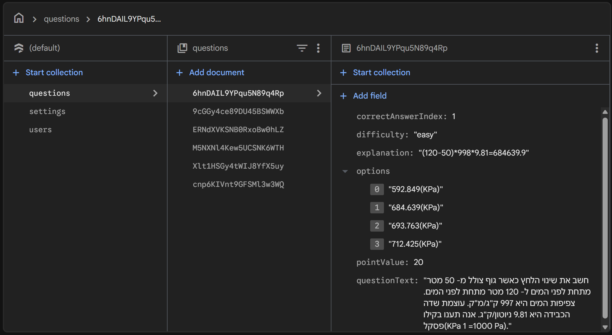
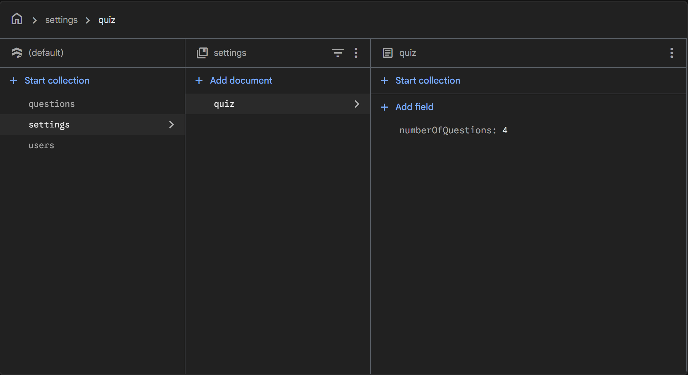

# מבוא

פרק זה מציג את הרקע לפרויקט "פיזיקה אינטראקטיבית", את מטרת המערכת ויכולותיה, את תהליך המחקר שקדם לפיתוח ואת האתגרים המרכזיים שעמדו בפניי במהלך העבודה.

---

## הרקע לפרויקט

### 1. שם הפרויקט
**פיזיקה אינטראקטיבית** (phiz) — אפליקציית אנדרואיד חינוכית ללימוד חוקי התנועה של ניוטון באמצעות סימולציות אינטראקטיביות ובחנים.

### 2. תיאור קצר של הפרויקט
הפרויקט הוא אפליקציה חינוכית לטלפונים ניידים (Android) המיועדת ללימוד עצמי ומודרך של שלושת חוקי ניוטון. האפליקציה משלבת שלושה רכיבים עיקריים:
- **סימולציות פיזיקליות אינטראקטיביות** — מאפשרות לתלמיד "לשחק" עם פרמטרים (מסה, כוח, חיכוך) ולראות בזמן אמת את השפעתם על תנועת גוף.
- **בחנים מותאמים אישית** — שאלות שנועדו לבדוק הבנה של החומר הנלמד, שמספרן ניתן להגדרה על ידי המורה.
- **מערכת מורה–תלמיד** — מבוססת תפקידים (roles), המאפשרת למורה לצפות בציוני כלל תלמידיו ולעקוב אחר התקדמותם.

האפליקציה מבוססת על Firebase (Authentication ו-Firestore) לאימות משתמשים ואחסון נתונים בענן.

### 3. קהל היעד
**תלמידי תיכון** הלומדים את פרק חוקי ניוטון במסגרת לימודי הפיזיקה, וכן **מורים לפיזיקה** בתיכון המעוניינים בכלי נלווה להעמקת ההבנה של תלמידיהם ולמעקב אחר ציוניהם.

### 4. הסיבות לבחירת הנושא
הבחירה בנושא נבעה מ**קושי אישי שחוויתי בפיזיקה**. במהלך לימודיי התקשיתי להמחיש לעצמי מושגים מופשטים כמו "כוח שקול", "תאוצה" ו-"חיכוך" רק מתוך נוסחאות וציורים סטטיים בספר. הבנתי שדווקא יכולת **לראות את הנוסחה פועלת** — לשנות ערך של כוח ולראות בזמן אמת כיצד הגוף מגיב — היא זו שתתן לחומר מובן אמיתי.

מתוך המחשבה שזהו קושי נפוץ גם אצל תלמידים נוספים, החלטתי לפתח כלי שיאפשר למידה חווייתית וחזותית של החומר, ובמקביל יספק למורים מידע על התקדמות כיתתם.

---

## מטרת המערכת

**מטרת המערכת היא לסייע לתלמידי תיכון להבין את חוקי ניוטון באמצעות התנסות אינטראקטיבית, ולספק למורים כלי למעקב ובדיקת הבנה.**

השימוש במערכת הוא כדלקמן:
- **תלמיד** נרשם למערכת ונכנס למסך הבית שלו. משם הוא יכול להיכנס לסימולציית פיזיקה, לשנות פרמטרים ולחקור בעצמו כיצד הם משפיעים על תנועת גוף. לאחר שהוא חש בנוח עם החומר, הוא יכול להיכנס למסך הבוחן, לענות על שאלות, ולקבל ציון שנשמר במערכת.
- **מורה** נרשם למערכת עם תפקיד "מורה", ומגיע למסך בית שונה המאפשר לו לראות את רשימת התלמידים ואת הציונים שלהם. כמו כן, הוא יכול להגדיר את **מספר השאלות** בכל בוחן כדי להתאים את רמת הקושי לכיתה שלו.

---

## יכולות המערכת

להלן רשימת היכולות המרכזיות (Feature List) של המערכת:

- **רישום והתחברות מאובטחים** באמצעות Firebase Authentication (אימייל וסיסמה).
- **ניווט מבוסס תפקידים** — תלמיד ומורה מגיעים לממשקים שונים בהתאם לתפקיד המוגדר להם ב-Firestore.
- **סימולציה פיזיקלית אינטראקטיבית** של חוקי ניוטון, המאפשרת למשתמש לשנות מסה, כוח, וחיכוך ולצפות בתנועה בזמן אמת על גבי `PhysicsSimulationView` מותאם אישית.
- **בוחן דינמי** שמספר שאלותיו ניתן להגדרה על ידי המורה.
- **שמירת ציונים בענן** — כל תוצאת בוחן נשמרת באופן אוטומטי ב-Firestore עם קישור למשתמש.
- **מסך ציונים לתלמיד** — התלמיד יכול לצפות בציונים שצבר בבחנים קודמים.
- **מסך ניהול למורה** — המורה רואה רשימת תלמידים עם הציונים של כל אחד.
- **התראות (Notifications)** ליידוע המשתמש על תזכורות ואירועים במערכת.
- **תמיכה מלאה בעברית (RTL)** בכל מסכי האפליקציה.

---

## תיאור תחום הידע

### 1. אובייקטים במערכת

האובייקטים המרכזיים (ישויות) במערכת "פיזיקה אינטראקטיבית":

- **משתמש (User)** — תלמיד או מורה הרשום במערכת
- **שאלה (Question)** — שאלת רב-ברירה השייכת למאגר השאלות
- **מבחן (Test)** — קבוצת שאלות עם מאפיינים (ציון עובר, הגבלת זמן)
- **תוצאת בוחן (QuizResult)** — תוצאה של מבחן שביצע תלמיד
- **העדפות התראות (NotificationPreferences)** — הגדרות ההתראות האישיות של המשתמש

### 2. סוגי נתונים

לכל אובייקט — אילו נתונים נשמרים:

**משתמש (User):**
- `uid` (String) — מזהה ייחודי (Firebase Auth UID)
- `name` (String) — שם תצוגה
- `email` (String) — כתובת אימייל
- `role` (String) — תפקיד: `"student"` או `"teacher"`
- `totalScore` (int) — ניקוד מצטבר ממבחנים

**שאלה (Question):**
- `questionId` (String) — מזהה שאלה
- `questionText` (String) — טקסט השאלה
- `options` (List\<String\>) — ארבע אפשרויות תשובה
- `correctAnswerIndex` (int) — אינדקס התשובה הנכונה (0–3)
- `pointValue` (int) — ערך נקודות
- `difficulty` (String) — רמת קושי: `easy`, `medium`, `hard`
- `explanation` (String) — הסבר לתשובה הנכונה (אופציונלי)

**מבחן (Test):**
- `testId` (String) — מזהה מבחן
- `testName` (String) — שם המבחן
- `subject` (String) — נושא
- `totalPoints` (int) — סכום נקודות כולל
- `passingScore` (int) — ציון עובר
- `timeLimit` (int) — הגבלת זמן בדקות
- `createdBy` (String) — מזהה המורה שיצר את המבחן
- `createdAt` (Timestamp) — חותמת זמן יצירה

**תוצאת בוחן (QuizResult):**
- `quizId` (String) — מזהה המבחן
- `userId` (String) — מזהה התלמיד
- `quizName` (String) — שם המבחן
- `score` (int) — הניקוד שהושג
- `totalQuestions` (int) — מספר השאלות במבחן
- `timestamp` (Timestamp) — חותמת זמן השלמת המבחן

### 3. ייצוג מידע

הנתונים נשמרים ב-**Cloud Firestore** — מסד נתונים NoSQL מבוסס מסמכים של Google Firebase. כל אובייקט נשמר כ-**Document** בתוך **Collection** (אוסף).

**מבנה האוספים:**

```
users/
  └── {userId}/
        ├── uid, email, name, role, totalScore, fcmToken, lastActivity
        └── grades/          ← תת-אוסף
              └── {gradeId}/
                    └── quizId, userId, quizName, score, totalQuestions, timestamp

questions/
  └── {questionId}/
        └── questionText, options[4], correctAnswerIndex, explanation, pointValue, difficulty

tests/
  └── {testId}/
        └── testName, subject, questions[], totalPoints, passingScore, timeLimit, createdBy, createdAt
```

**קשרים:**
- לכל משתמש יש תת-אוסף `grades` המכיל את כל תוצאות המבחנים שלו.
- כל מבחן (`Test`) מכיל רשימת שאלות (`questions[]`) ומזוהה עם המורה שיצר אותו דרך `createdBy`.

**נימוק הבחירה:**
בחרתי להשתמש ב-Firestore מכיוון שהוא מאפשר עדכונים בזמן אמת, סנכרון אוטומטי בין מכשירים, ואינו מחייב ניהול שרת עצמאי — דבר המתאים לפרויקט מובייל בהיקף בינוני. מבנה המסמכים הגמיש של Firestore (בניגוד לטבלאות רלציוניות) מתאים לאובייקטים בעלי שדות שונים, כמו שאלה שיכולה להכיל מספר אפשרויות תשובה משתנה.

**צילומי מסך מ-Firestore:**



*אוסף `users` — כל מסמך מייצג משתמש (תלמיד או מורה) עם השדות `uid`, `email`, `name`, `role`, `totalScore`.*



*אוסף `questions` — מאגר השאלות המרכזי, כולל טקסט השאלה, ארבע אפשרויות תשובה, אינדקס התשובה הנכונה, רמת קושי וערך נקודות.*



*הגדרות המערכת — בין היתר, מספר השאלות בכל בוחן (`questionsPerQuiz`) שמוגדר על ידי המורה.*

### 4. פעולות על המידע

להלן הפעולות העיקריות שמתבצעות על הנתונים במערכת:

| פעולה | תיאור | מי מבצע |
|-------|--------|---------|
| **יצירת משתמש (Register)** | יצירת חשבון ב-Firebase Auth ושמירת אובייקט `User` ב-Firestore | תלמיד / מורה |
| **כניסה למערכת (Login)** | אימות מול Firebase Auth וקריאת שדה `role` לניתוב | תלמיד / מורה |
| **שמירת תוצאת מבחן** | שמירת `QuizResult` בתת-אוסף `grades` של המשתמש | מערכת (אוטומטי) |
| **עדכון ניקוד** | עדכון שדה `totalScore` במסמך המשתמש לאחר כל מבחן | מערכת (אוטומטי) |
| **שליפת ציונים** | קריאת כל תוצאות המבחנים מ-Firestore להצגה לתלמיד | תלמיד |
| **יצירת שאלה** | שמירת אובייקט `Question` באוסף `questions` | מורה |
| **מחיקת שאלה** | הסרת מסמך שאלה מאוסף `questions` | מורה |
| **צפייה בציוני כל התלמידים** | שליפת נתוני ציונים מ-Firestore עבור כל התלמידים | מורה |
| **הגדרת מספר שאלות במבחן** | עדכון הגדרת מספר השאלות שנשלף בכל מבחן | מורה |

---

## תהליך המחקר

### מחקר על תחום הידע
לפני תחילת הפיתוח ערכתי מחקר על הדרישות של תוכנית הלימודים של משרד החינוך בנושא חוקי ניוטון בתיכון, במטרה להבין אילו מושגים חייבים להופיע בסימולציה ובבוחן כדי שיהיה כלי רלוונטי ללימוד. שלושת חוקי ניוטון — חוק ההתמדה, חוק התנועה (F = m·a) וחוק הפעולה והתגובה — נבחרו כליבת התוכן של האפליקציה.

### עבודת שטח — השוואה ל-Khan Academy
ערכתי השוואה לאתר החינוך המוביל **Khan Academy**, שמלמד את חוקי ניוטון באמצעות שיעורי וידאו ותרגילים כתובים. הממצאים העיקריים היו:

| היבט | Khan Academy | פיזיקה אינטראקטיבית |
|------|--------------|--------------------|
| פורמט עיקרי | וידאו + תרגילים טקסטואליים | **סימולציה אינטראקטיבית** |
| התנסות | פסיבית (צפייה) | **פעילה (מניפולציה של פרמטרים)** |
| שפה | אנגלית (תרגום חלקי בלבד לעברית) | **עברית מלאה, RTL** |
| התאמה לתכנית הלימודים הישראלית | כללית | **מותאמת לתיכון בישראל** |
| ממשק מורה | אין (כלי למידה בלבד) | **מעקב אחר ציוני תלמידים** |

המסקנה הייתה שיש מקום לכלי עברי, אינטראקטיבי, המציע חוויה פעילה ולא רק פסיבית, וכולל ממשק ניהול למורה — יכולות שלא קיימות ב-Khan Academy.

### פירוט טכנולוגיות
בחנתי מספר טכנולוגיות ובחרתי את אלו שמתאימות ביותר לפרויקט:

- **Android Studio + Java** — סביבת הפיתוח והשפה, מאפשרות הגעה לקהל רחב של משתמשי Android.
- **Firebase Authentication** — ניהול משתמשים מאובטח ללא צורך בכתיבת שרת אימות עצמאי.
- **Cloud Firestore** — מסד נתונים NoSQL בענן לשמירת פרטי משתמשים, ציונים והגדרות.
- **Material Components** — רכיבי ממשק מודרניים התומכים ב-RTL באופן מובנה.
- **Canvas API של Android** — שימוש ב-`View` מותאם אישית (`PhysicsSimulationView`) לציור הסימולציה הפיזיקלית בזמן אמת.

---

## אתגרים מרכזיים

לאורך הפיתוח עמדו בפניי מספר אתגרים משמעותיים:

### 1. לימוד סביבת הפיתוח Android Studio
זו הייתה התנסותי הראשונה בפיתוח אפליקציית אנדרואיד מלאה. נדרשתי להכיר לעומק את מחזור החיים של Activity, את מערכת הבנייה Gradle, את מערכת ה-resources (layouts, strings, drawables), ואת תצורת ה-Manifest. ההתמודדות כללה שעות רבות של לימוד מתיעוד רשמי ומקורסים, וכן פתרון בעיות תצורה של Gradle ו-JAVA_HOME.

### 2. שילוב Firebase בפרויקט
אינטגרציה של Firebase הציבה מספר אתגרים:
- **אתחול נכון של Firebase** — הייתה חובה ליצור מחלקת `Application` מותאמת (`PhizApplication`) שתקרא ל-`FirebaseApp.initializeApp()` לפני שרותים אחרים, אחרת התקבלה שגיאת `CONFIGURATION_NOT_FOUND`.
- **הרשאות Firestore** — הגדרת חוקי Security Rules נכונים הייתה קריטית. בתחילה קיבלתי שגיאות `PERMISSION_DENIED` עד שהבנתי שיש להפעיל את Cloud Firestore API ולכתוב כללי גישה המגבילים משתמש למסמך שלו בלבד.
- **סנכרון בין Authentication ל-Firestore** — נתקלתי בבאג שבו משתמש נוצר ב-Authentication אך לא ב-Firestore, וכתוצאה מכך ההתחברות נכשלה. פתרתי זאת על ידי וידוא ששתי הפעולות מתבצעות ברצף ושתיהן חייבות להצליח.

### 3. מימוש סימולציה פיזיקלית
בניית מנוע סימולציה פיזיקלי בסיסי חייבה הבנה של משוואות התנועה ויישומן בקוד. הבעיות כללו:
- **לולאת רינדור חלקה** — שימוש ב-`postInvalidateOnAnimation()` לציור על Canvas בקצב קבוע מבלי לגרום ל-UI Thread להיות עמוס.
- **חישוב נכון של פיזיקה בזמן אמת** — התאמת צעד זמן (`deltaTime`) והחלת נוסחאות ניוטון (F = m·a, v = v₀ + a·t) על מיקום הגוף בכל פריים.
- **המרה בין יחידות מסך ליחידות פיזיקליות** — פיקסלים לעומת מטרים.

### 4. תמיכה מלאה בעברית (RTL)
Android תומך ב-RTL אך ישנן נקודות שדורשות התייחסות מיוחדת:
- וידוא ש-`android:supportsRtl="true"` מוגדר ב-Manifest.
- שימוש ב-`start`/`end` במקום `left`/`right` ב-layouts.
- התאמת כיוון הצגה בטקסטים המעורבים (עברית + אנגלית + מספרים).
- טיפול נכון בכיוון הסימולציה עצמה — היא חייבת להישאר עקבית (LTR) גם כשהממשק הכללי הוא RTL, שכן פיזיקה מוצגת בכיוון מתמטי סטנדרטי.

### 5. עיצוב חוויית משתמש שונה לשני סוגי משתמשים
תכנון ניווט מבוסס תפקידים דרש חשיבה על שני זרמי משתמש נפרדים: תלמיד ומורה. נדרשה הפרדה ברורה של מסכים, של הרשאות ושל פעולות, תוך שמירה על מודל נתונים אחיד ב-Firestore.

---

## הצגת הפתרונות במסגרת המחקר המקדים

בעקבות המחקר, החלטתי שהפרויקט יכלול את החידושים הבאים ביחס לכלים קיימים:
- **אינטראקטיביות אמיתית** — בניגוד לצפייה פסיבית בווידאו, המשתמש הוא זה שמפעיל את הסימולציה.
- **עברית כשפה ראשית** — ולא תרגום משני של כלי אנגלי.
- **מודול מורה** — שאינו קיים ברוב כלי הלמידה עצמאיים, ונותן לתכונה זו ערך כיתתי ולא רק אינדיבידואלי.
- **פלטפורמת מובייל** — נגישה מכל מקום, בניגוד לכלים המחייבים גישה למחשב.
