# פרק: מבנה / ארכיטקטורה של הפרויקט

## אפליקציית Phiz – Android עם Firebase להוראת חוקי ניוטון

פרק זה מתאר את מבנה האפליקציה, את המסכים המרכזיים שבה, את הקשרים ביניהם ואת המחלקות העיקריות בפרויקט.

האפליקציה מבוססת על **Android Studio** ובנויה ב-**Java**, ומשתמשת בשירותי **Firebase** לצורך הרשמה, התחברות, שמירת נתונים, שליפתם בזמן אמת ושליחת התראות.

האפליקציה כוללת שני חלקים מרכזיים:

- **צד משתמש (תלמיד / מורה)** – צפייה בסימולציה אינטראקטיבית של חוקי ניוטון, ביצוע מבחנים, צפייה בציונים וניהול שאלות.
- **צד מערכת / נתונים** – ניהול משתמשים, שמירת תוצאות מבחנים, שליפת מאגר שאלות, שליחת התראות מתוזמנות ועדכון מידע דרך Firebase.

האפליקציה מבוססת על מערכת תפקידים (`role`) המבחינה בין שני סוגי משתמשים: **תלמיד (student)** ו-**מורה (teacher)**, וכל משתמש מנותב למסכים שונים בהתאם לתפקידו.

---

## 1. תכנון ותיעוד מסכי הפרויקט

### מסך פתיחה (MainActivity)

**תפקיד המסך:**
מסך ראשוני המופיע בעת פתיחת האפליקציה.

**מה המסך מכיל:**
- לוגו האפליקציה
- שם האפליקציה
- רקע מעוצב

**מה ניתן לבצע:**
אין פעולה מצד המשתמש. לאחר זמן קצר מתבצע מעבר אוטומטי למסך ההתחברות.

**מטרת המסך:**
ליצור פתיחה נעימה לאפליקציה ולבדוק אם המשתמש כבר מחובר. אם כן – מתבצע ניתוב אוטומטי למסך הבית המתאים לתפקידו (תלמיד או מורה).

---

### מסך התחברות (LoginActivity)

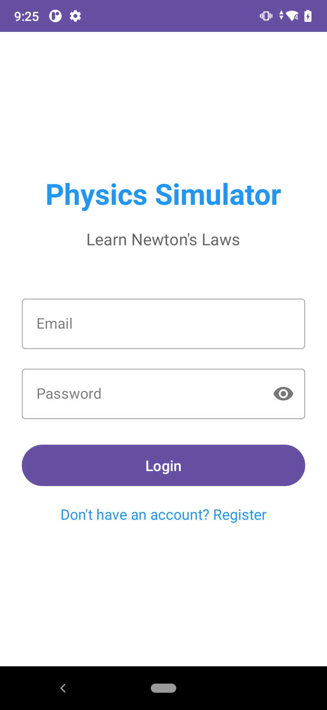

**תפקיד המסך:**
לאפשר למשתמש להתחבר לחשבון קיים.

**מה המסך מכיל:**
- שדה להזנת אימייל
- שדה להזנת סיסמה (עם אפשרות להצגה/הסתרה)
- כפתור "התחברות"
- קישור למסך הרשמה
- אינדיקטור טעינה (ProgressBar)
- הודעת שגיאה במקרה של קלט שגוי

**מה ניתן לבצע:**
- הזנת פרטי משתמש
- התחברות לחשבון
- מעבר למסך הרשמה

**תפקיד האלמנטים במסך:**
- `TextInputEditText` אימייל – קבלת כתובת אימייל מהמשתמש
- `TextInputEditText` סיסמה – קבלת סיסמה
- `Button` התחברות – שליחת הנתונים לבדיקה מול Firebase Authentication
- `TextView` הרשמה – מעבר למסך ההרשמה
- `ProgressBar` – הצגת מצב טעינה במהלך התחברות

---

### מסך הרשמה (RegisterActivity)

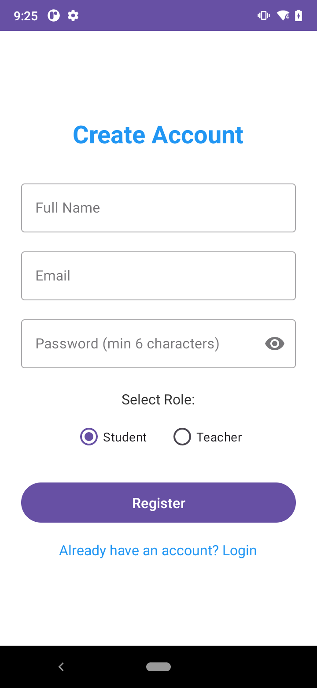

**תפקיד המסך:**
יצירת משתמש חדש במערכת.

**מה המסך מכיל:**
- שדה שם משתמש
- שדה אימייל
- שדה סיסמה
- בחירת תפקיד (תלמיד / מורה) באמצעות `RadioGroup`
- כפתור "הרשמה"
- קישור חזרה למסך התחברות

**מה ניתן לבצע:**
- יצירת חשבון חדש
- בחירת תפקיד (תלמיד או מורה)
- שמירת פרטי המשתמש במסד הנתונים

**תפקיד האלמנטים במסך:**
- `TextInputEditText` שם – קבלת שם המשתמש
- `TextInputEditText` אימייל – קבלת כתובת אימייל
- `TextInputEditText` סיסמה – קבלת סיסמה
- `RadioGroup` – בחירת תפקיד (תלמיד או מורה)
- `Button` הרשמה – יצירת המשתמש ב-Firebase Authentication ושמירת פרטיו ב-Firestore

---

### מסך בית לתלמיד (StudentHomeActivity)

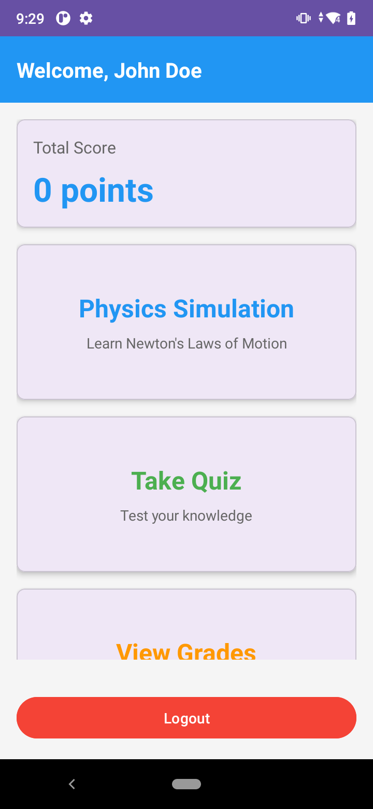

**תפקיד המסך:**
המסך המרכזי של התלמיד לאחר ההתחברות.

**מה המסך מכיל:**
- הודעת ברכה אישית עם שם המשתמש
- הצגת ניקוד מצטבר (Total Score)
- כרטיס "סימולציית פיזיקה"
- כרטיס "מבחן"
- כרטיס "ציונים"
- כפתור "הגדרות התראות"
- כפתור "התנתקות"

**מה ניתן לבצע:**
- מעבר לסימולציה אינטראקטיבית של חוקי ניוטון
- ביצוע מבחן בנושא חוקי ניוטון
- צפייה בהיסטוריית הציונים האישית
- הגדרת העדפות התראות
- התנתקות מהחשבון

**תפקיד האלמנטים במסך:**
- `MaterialCardView` – כרטיסים לחיצים למעבר בין הפעילויות
- `TextView` ברכה – מציג את שם המשתמש המחובר
- `TextView` ניקוד – מציג את הניקוד הכולל מהמבחנים

---

### מסך בית למורה (TeacherHomeActivity)

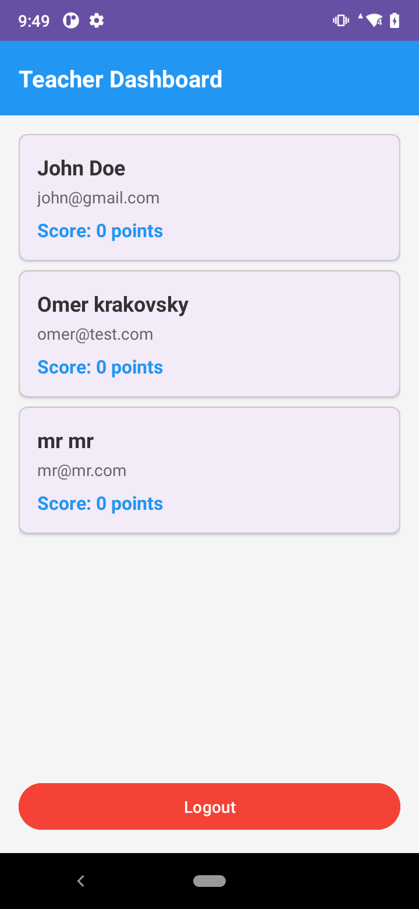

**תפקיד המסך:**
המסך המרכזי של המורה לניהול תלמידים, שאלות וציונים.

**מה המסך מכיל:**
- רשימת תלמידים רשומים במערכת (`RecyclerView`)
- כרטיס "יצירת שאלה חדשה"
- כרטיס "צפייה במאגר שאלות"
- כרטיס "ציוני כל התלמידים"
- כפתור "הגדרות התראות"
- כפתור "התנתקות"
- הודעה כשאין תלמידים רשומים

**מה ניתן לבצע:**
- צפייה בכל התלמידים והניקוד שלהם
- יצירת שאלות חדשות למאגר
- צפייה ועריכה של מאגר השאלות
- צפייה בציוני כלל התלמידים
- התנתקות מהחשבון

**תפקיד האלמנטים במסך:**
- `RecyclerView` – מציג את רשימת התלמידים בעזרת `StudentAdapter`
- `MaterialCardView` – כרטיסים לחיצים לפעולות הניהוליות
- `LinearLayout` empty state – מוצג כאשר אין תלמידים

**דיאלוג הגדרות מבחן (Quiz Settings):**

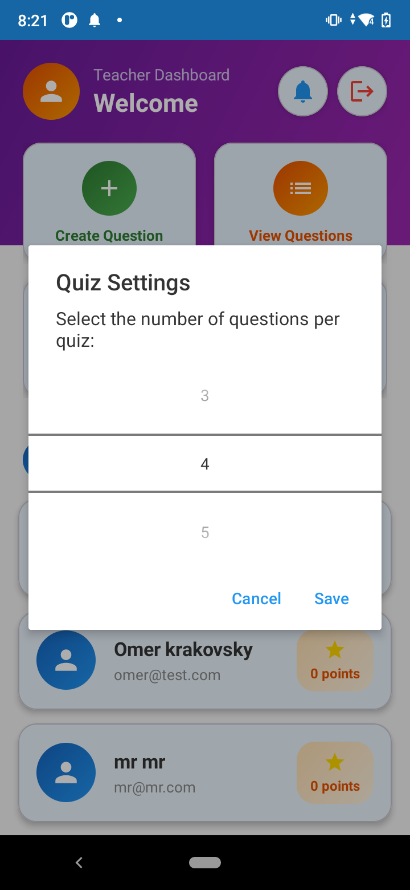

לחיצה על "Quiz Settings" פותחת דיאלוג הבוחר את מספר השאלות לכל מבחן (3, 4 או 5).

---

### מסך סימולציית פיזיקה (PhysicsSimulationActivity)

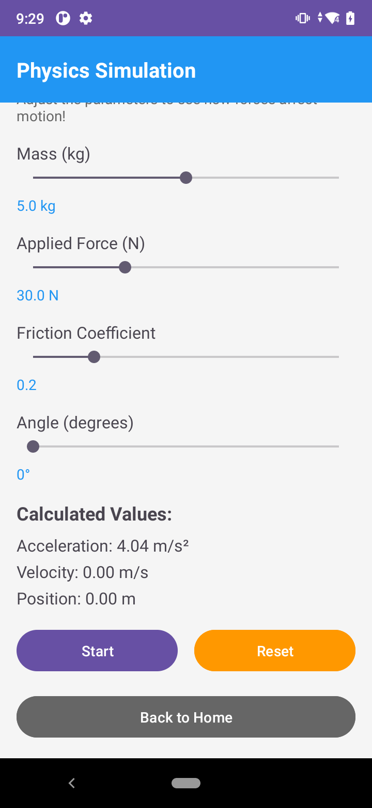

**תפקיד המסך:**
הצגת סימולציה אינטראקטיבית של חוקי ניוטון לתנועה.

**מה המסך מכיל:**
- אזור ציור מותאם אישית (`PhysicsSimulationView`) המציג עצם, משטח ווקטורי כוח
- מחוון `SeekBar` לקביעת מסה (0.1 – 10.0 ק"ג)
- מחוון `SeekBar` לקביעת כוח מופעל (0 – 100 ניוטון)
- מחוון `SeekBar` לקביעת מקדם חיכוך (0 – 1.0)
- מחוון `SeekBar` לקביעת זווית המשטח (0° – 90°)
- שדות תצוגה לערכי תאוצה, מהירות ומיקום בזמן אמת
- תיאור טקסטואלי של חוקי ניוטון
- כפתור "התחל"
- כפתור "איפוס"
- כפתור "חזרה"

**מה ניתן לבצע:**
- שינוי הפרמטרים הפיזיקליים בזמן אמת
- הפעלת אנימציה של תנועת העצם
- צפייה בוקטורי כוח (כבידה, נורמלי, מופעל, חיכוך)
- איפוס הסימולציה למצב ההתחלתי

**תפקיד האלמנטים במסך:**
- `PhysicsSimulationView` – `View` מותאם אישית המבצע את הציור והאנימציה
- `SeekBar` – שינוי פרמטרים פיזיקליים
- `TextView` – הצגת ערכי הפרמטרים והתוצאות החישוביות
- `Button` – שליטה במצב האנימציה

---

### מסך מבחן (QuizActivity)

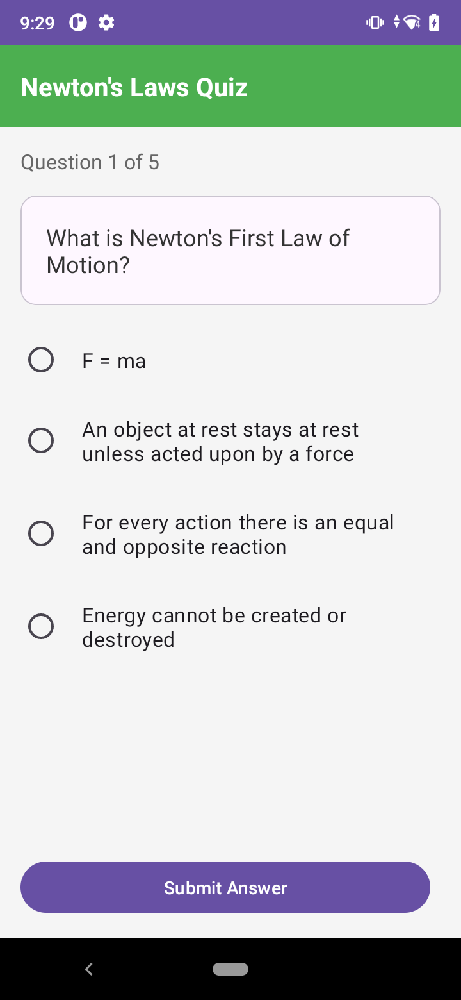

**תפקיד המסך:**
ביצוע מבחן רב-ברירה על חוקי ניוטון.

**מה המסך מכיל:**
- הצגת מספר השאלה הנוכחית מתוך הסך הכללי
- טקסט השאלה
- ארבע אפשרויות תשובה (`RadioGroup` עם 4 `RadioButton`)
- שעון עצר לכל שאלה (30 שניות)
- כפתור "שלח תשובה"
- כפתור "שאלה הבאה"
- כרטיס משוב המציג אם התשובה הייתה נכונה
- כפתור עיפרון להפעלת אזור שרבוט (`DoodleView`) לחישובים זמניים
- כפתור לניקוי השרבוט

**מה ניתן לבצע:**
- בחירת תשובה מבין ארבע אפשרויות
- שליחת התשובה לבדיקה
- צפייה במשוב מיידי לכל שאלה
- שרבוט וחישובים על אזור הציור
- מעבר לשאלה הבאה

**תפקיד האלמנטים במסך:**
- `TextView` שאלה – מציג את הטקסט הנוכחי
- `RadioGroup` תשובות – מציג את ארבע האפשרויות (מערכת מערבבת אותן)
- `Button` שלח – בודק את התשובה ומעדכן את הניקוד
- `Button` הבא – טוען את השאלה הבאה
- `CountDownTimer` – ספירה לאחור פר שאלה
- `DoodleView` – אזור ציור חופשי לחישובים

---

### מסך ציונים (GradesActivity)

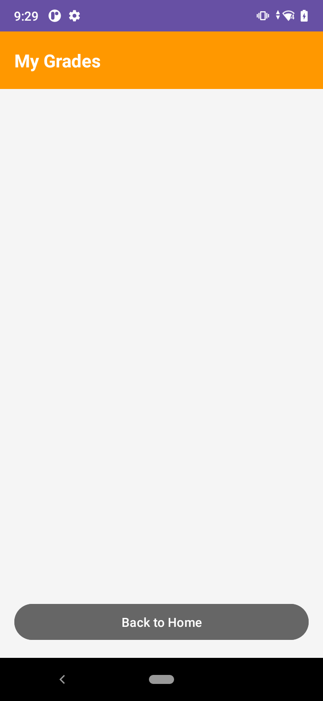

**תפקיד המסך:**
הצגת היסטוריית הציונים האישית של התלמיד.

**מה המסך מכיל:**
- רשימה של תוצאות מבחנים (`RecyclerView`)
- בכל פריט: שם המבחן, תאריך ושעה, ניקוד, אחוזים
- הודעה כשאין מבחנים שבוצעו
- כפתור "חזרה"

**מה ניתן לבצע:**
- צפייה בכל תוצאות המבחנים שביצע התלמיד
- חזרה למסך הבית

**תפקיד האלמנטים במסך:**
- `RecyclerView` – הצגת רשימת התוצאות בעזרת `GradeAdapter`
- `TextView` הצגת תאריך – פורמט "MMM dd, yyyy HH:mm"
- `TextView` הצגת ניקוד ואחוזים

---

### מסך יצירת שאלה (CreateQuestionActivity)

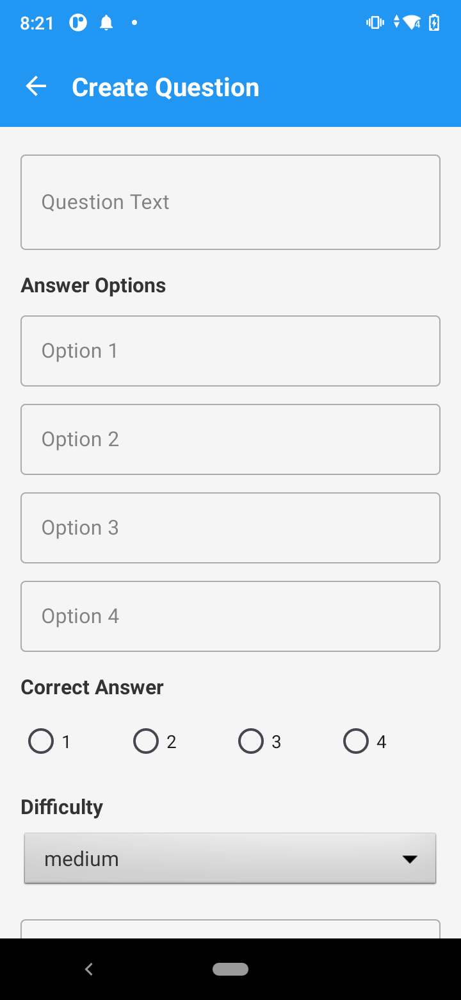

**תפקיד המסך:**
מסך למורה ליצירת שאלה חדשה במאגר.

**מה המסך מכיל:**
- שדה טקסט לשאלה
- ארבעה שדות טקסט לאפשרויות התשובה
- `RadioGroup` לבחירת התשובה הנכונה
- `Spinner` לבחירת רמת קושי (קל / בינוני / קשה)
- שדה טקסט להסבר (אופציונלי)
- שדה טקסט לערך הנקודות
- כפתור "שמירה"
- סרגל כלים עליון (`MaterialToolbar`)

**מה ניתן לבצע:**
- הוספת שאלה חדשה למאגר ה-Firestore
- בחירת התשובה הנכונה והגדרת ערך נקודות
- הוספת הסבר מילולי

**תפקיד האלמנטים במסך:**
- `TextInputEditText` – שדות הקלט של השאלה והתשובות
- `RadioGroup` – סימון התשובה הנכונה (1–4)
- `Spinner` – בחירת רמת קושי
- `Button` שמירה – יצירת אובייקט `Question` ושמירתו ב-Firestore

---

### מסך מאגר השאלות (ViewQuestionsActivity)

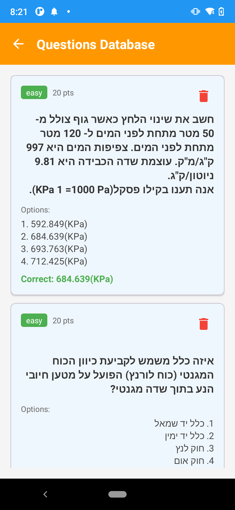

**תפקיד המסך:**
הצגת כל השאלות הקיימות במערכת למורה.

**מה המסך מכיל:**
- רשימת שאלות (`RecyclerView`)
- בכל פריט: טקסט השאלה, רמת קושי, ערך נקודות
- הודעה כשהמאגר ריק
- סרגל כלים עליון
- אינדיקטור טעינה

**מה ניתן לבצע:**
- צפייה בכל השאלות במאגר
- מחיקת שאלה (לאחר אישור)
- חזרה למסך הבית של המורה

**תפקיד האלמנטים במסך:**
- `RecyclerView` – מציג רשימה של שאלות בעזרת `QuestionAdapter`
- `ImageButton` מחיקה – מציג דיאלוג אישור ומוחק מ-Firestore
- `AlertDialog` – אישור פעולת מחיקה

---

### מסך ציוני כל התלמידים (AllGradesActivity)

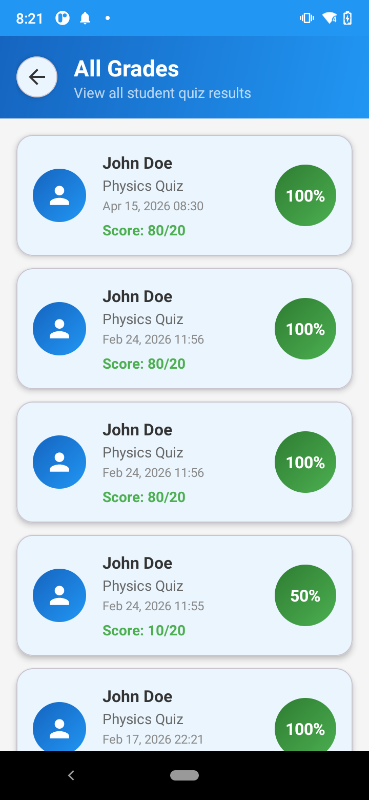

**תפקיד המסך:**
מאפשר למורה לראות את כל הציונים של כל התלמידים במערכת.

**מה המסך מכיל:**
- רשימת תלמידים והציונים שלהם (`RecyclerView`)
- בכל פריט: שם תלמיד, ציון אחרון, ניקוד מצטבר, תאריך מבחן אחרון
- הודעה כשאין נתונים
- כפתור "חזרה"
- אינדיקטור טעינה

**מה ניתן לבצע:**
- צפייה במצב הכולל של כל התלמידים
- חזרה למסך הבית של המורה

**תפקיד האלמנטים במסך:**
- `RecyclerView` – הצגת רשימת ציונים מסוכמת לכל תלמיד
- `AllGradesAdapter` – מתאם המאגד תוצאות ממסד הנתונים

---

### מסך הגדרות התראות (NotificationSettingsActivity)

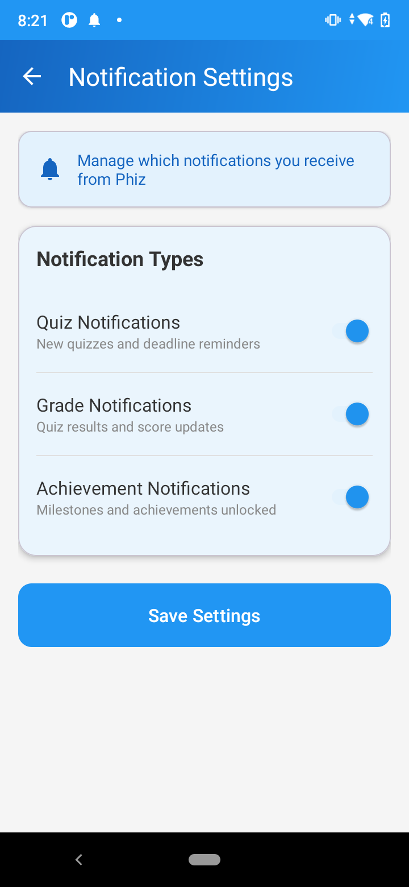

**תפקיד המסך:**
ניהול העדפות ההתראות של המשתמש.

**מה המסך מכיל:**
- מתג "התראות מבחנים" (`SwitchMaterial`)
- מתג "התראות ציונים"
- מתג "התראות הישגים"
- מתג "תזכורות לימוד" (תלמידים בלבד)
- מתג "סיכום שבועי" (תלמידים בלבד)
- בורר שעת תזכורת (`TimePickerDialog`)
- כפתור "שמירה"
- סרגל כלים עליון

**מה ניתן לבצע:**
- הפעלה / כיבוי של סוגי התראות שונים
- קביעת שעת תזכורת יומית
- שמירת ההעדפות

**תפקיד האלמנטים במסך:**
- `SwitchMaterial` – הפעלה/כיבוי של כל סוג התראה
- `MaterialCardView` שעת תזכורת – פותח `TimePickerDialog`
- `Button` שמירה – שומר את `NotificationPreferences` ב-Firestore ומתזמן את ה-`Workers`

---

## 2. תרשים זרימת מסכים (Flow)

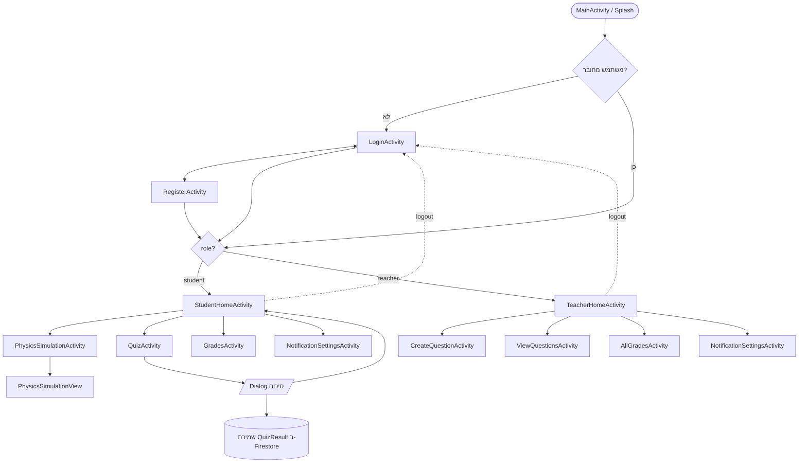

**תיאור מילולי של הזרימה:**
1. בעת פתיחת האפליקציה, נטען `MainActivity` (מסך פתיחה).
2. אם המשתמש לא מחובר – הוא מועבר ל-`LoginActivity`. אם מחובר – המערכת קוראת את שדה `role` מ-Firestore ומנתבת בהתאם.
3. ממסך ההתחברות ניתן לעבור למסך ההרשמה ובחזרה.
4. לאחר התחברות / הרשמה, התלמיד מועבר ל-`StudentHomeActivity` והמורה ל-`TeacherHomeActivity`.
5. כל מסך בית מאפשר ניווט למסכים פנימיים: סימולציה, מבחן, ציונים והגדרות (תלמיד), או יצירת שאלות, צפייה במאגר וצפייה בציונים (מורה).
6. בכל המסכים פעולת התנתקות מחזירה את המשתמש ל-`LoginActivity`.

---

## 3. תיאור מחלקות הפרויקט

### מחלקות מודל (Model Classes)

#### מחלקת User

**תפקיד המחלקה:**
מייצגת משתמש במערכת – תלמיד או מורה.

**תכונות עיקריות:**
- `uid` – מזהה ייחודי (Firebase Auth UID)
- `email` – כתובת אימייל
- `name` – שם תצוגה
- `role` – תפקיד (`"student"` או `"teacher"`)
- `totalScore` – ניקוד מצטבר ממבחנים

**שימוש במחלקה:**
המחלקה משמשת לשמירת פרטי המשתמש במסד הנתונים ולהצגתם במסכים שונים. ה-`role` קובע את ניתוב המשתמש למסך הבית המתאים לאחר ההתחברות.

---

#### מחלקת Question

**תפקיד המחלקה:**
מייצגת שאלה במאגר השאלות של האפליקציה.

**תכונות עיקריות:**
- `questionId` – מזהה שאלה
- `questionText` – טקסט השאלה
- `options` – רשימת ארבע אפשרויות תשובה
- `correctAnswerIndex` – אינדקס התשובה הנכונה (0–3)
- `explanation` – הסבר על התשובה (אופציונלי)
- `pointValue` – ערך נקודות
- `difficulty` – רמת קושי (`easy`, `medium`, `hard`)

**שימוש במחלקה:**
מאחסנת את השאלות הזמינות במאגר ה-Firestore, נשלפת ב-`QuizActivity` להצגה בפני התלמידים, וב-`ViewQuestionsActivity` לצורך ניהול על ידי המורה.

---

#### מחלקת Test

**תפקיד המחלקה:**
מייצגת מבחן שלם הכולל מספר שאלות ונתוני מטא.

**תכונות עיקריות:**
- `testId` – מזהה מבחן
- `testName` – שם המבחן
- `subject` – נושא (לדוגמה: "חוקי ניוטון")
- `questions` – רשימת אובייקטי `Question`
- `totalPoints` – סכום נקודות כולל
- `passingScore` – ציון עובר
- `timeLimit` – הגבלת זמן בדקות
- `difficulty` – רמת קושי
- `createdBy` – מזהה המורה שיצר את המבחן
- `createdAt` / `updatedAt` – חותמות זמן

**שימוש במחלקה:**
משמשת לקיבוץ שאלות למבחן בעל מאפיינים ייחודיים, נשמרת באוסף `tests` ב-Firestore.

---

#### מחלקת QuizResult

**תפקיד המחלקה:**
מייצגת תוצאה של מבחן יחיד שביצע תלמיד.

**תכונות עיקריות:**
- `quizId` – מזהה המבחן
- `userId` – מזהה התלמיד
- `quizName` – שם המבחן
- `score` – הניקוד שהושג
- `totalQuestions` – מספר השאלות במבחן
- `timestamp` – חותמת זמן השלמת המבחן

**שימוש במחלקה:**
משמשת לשמירת תוצאות המבחנים ב-Firestore (תת-אוסף `grades` תחת המשתמש), ולהצגתן ב-`GradesActivity` ו-`AllGradesActivity`.

---

#### מחלקת NotificationPreferences

**תפקיד המחלקה:**
מייצגת את העדפות ההתראות של המשתמש.

**תכונות עיקריות:**
- `quizNotifications` – התראות על מבחנים
- `gradeNotifications` – התראות על ציונים
- `achievementNotifications` – התראות על הישגים
- `studyReminders` – תזכורות לימוד
- `weeklyProgress` – התראות סיכום שבועי
- `reminderTime` – שעת תזכורת יומית
- `reminderDays` – ימי השבוע לתזכורת

**שימוש במחלקה:**
נשמרת תחת מסמך המשתמש ב-Firestore, ונקראת על ידי ה-`Workers` כדי לקבוע מתי לשלוח התראות.

---

### מחלקות פעילות (Activity Classes)

#### מחלקת PhizApplication

**תפקיד המחלקה:**
מחלקת `Application` מותאמת המתבצעת באתחול האפליקציה.

**פעולה עיקרית:**
- אתחול Firebase דרך `FirebaseApp.initializeApp(this)` – חיוני לפני שימוש בכל שירות Firebase.

**שימוש במחלקה:**
רשומה ב-`AndroidManifest.xml` בתור מחלקת ה-Application הראשית, ומבצעת אתחול חד-פעמי בעת הפעלת האפליקציה.

---

#### מחלקת MainActivity

**תפקיד המחלקה:**
נקודת כניסה לאפליקציה (Launcher Activity).

**פעולה עיקרית:**
- בדיקה אם המשתמש כבר מחובר
- ניתוב אוטומטי למסך המתאים (Login / StudentHome / TeacherHome)

---

#### מחלקת LoginActivity

**תפקיד המחלקה:**
מטפלת בלוגיקת ההתחברות מול Firebase Authentication וקריאת התפקיד מ-Firestore.

---

#### מחלקת RegisterActivity

**תפקיד המחלקה:**
יוצרת משתמש חדש ב-Firebase Authentication ובמקביל שומרת אובייקט `User` באוסף `users` ב-Firestore.

---

#### מחלקת StudentHomeActivity

**תפקיד המחלקה:**
מסך הבית של התלמיד, המספק נקודות ניווט לכל התכונות הזמינות לתלמידים.

---

#### מחלקת TeacherHomeActivity

**תפקיד המחלקה:**
מסך הבית של המורה. כוללת מחלקה פנימית `StudentAdapter` המציגה את רשימת התלמידים.

---

#### מחלקת PhysicsSimulationActivity

**תפקיד המחלקה:**
שולטת בסימולציית הפיזיקה. מקשרת בין מחווני הקלט (`SeekBar`) לבין `PhysicsSimulationView` המבצעת את החישוב והציור.

---

#### מחלקת QuizActivity

**תפקיד המחלקה:**
מנהלת את לוגיקת המבחן: ערבוב תשובות, מעקב אחר ניקוד, שעון עצר, ושמירת התוצאה ב-Firestore בתום המבחן.

---

#### מחלקת GradesActivity

**תפקיד המחלקה:**
שולפת את היסטוריית הציונים של התלמיד מ-Firestore ומציגה אותם ברשימה. כוללת מחלקה פנימית `GradeAdapter`.

---

#### מחלקת CreateQuestionActivity

**תפקיד המחלקה:**
מאפשרת למורה ליצור שאלות חדשות, לבצע ולידציה על השדות, ולשמור אותן באוסף `questions` ב-Firestore.

---

#### מחלקת ViewQuestionsActivity

**תפקיד המחלקה:**
מציגה למורה את כל השאלות הקיימות במאגר ומאפשרת מחיקה. משתמשת ב-`QuestionAdapter`.

---

#### מחלקת AllGradesActivity

**תפקיד המחלקה:**
מציגה למורה תצוגת-על של ציוני כל התלמידים. משתמשת ב-`AllGradesAdapter` ובמחלקת עזר פנימית `UserGrade`.

---

#### מחלקת NotificationSettingsActivity

**תפקיד המחלקה:**
מנהלת את העדפות ההתראות של המשתמש. נטענת בה אובייקט `NotificationPreferences`, ובלחיצה על "שמירה" מתעדכנים גם ה-`Workers` המתוזמנים.

---

### מחלקות תצוגה מותאמות אישית (Custom Views)

#### מחלקת PhysicsSimulationView

**תפקיד המחלקה:**
תצוגה מותאמת אישית (`extends View`) המבצעת את הציור והאנימציה של סימולציית חוקי ניוטון.

**תכונות עיקריות:**
- פרמטרים פיזיקליים: `mass`, `appliedForce`, `frictionCoefficient`, `angle`
- מצב אנימציה: `velocity`, `acceleration`, `position`, `isAnimating`
- אובייקטי `Paint` לציור: עצם, משטח, וקטורים, טקסט
- מאזין `OnPhysicsUpdateListener` המעדכן את ה-Activity בערכים מחושבים

**פעולות עיקריות:**
- `setParameters()` – הגדרת ערכי הפיזיקה
- `startAnimation()` / `stopAnimation()` – שליטה באנימציה
- `reset()` – איפוס למצב התחלתי
- `onDraw()` – ציור העצם, המשטח ווקטורי הכוח

**שימוש במחלקה:**
ממומשת ב-`PhysicsSimulationActivity` ומספקת ויזואליזציה בזמן אמת של חוקי ניוטון.

---

#### מחלקת DoodleView

**תפקיד המחלקה:**
תצוגה מותאמת אישית לציור חופשי (שרבוט) במסך המבחן.

**שימוש במחלקה:**
מופעלת ב-`QuizActivity` כדי לאפשר לתלמיד לבצע חישובים זמניים על המסך תוך כדי פתרון שאלה.

---

### מחלקות עזר (Helper Classes)

#### מחלקת FirestoreHelper

**תפקיד המחלקה:**
ממומשת בתבנית **Singleton**, ומרכזת את כל פעולות הקריאה והכתיבה מול Cloud Firestore.

**פעולות עיקריות:**
- שמירה ושליפה של משתמשים (`users`)
- שמירה ושליפה של ציונים (`users/{userId}/grades`)
- שמירה, שליפה ומחיקה של שאלות (`questions`)
- שמירה ושליפה של מבחנים (`tests`)
- עדכון פעילות אחרונה של משתמש (לצורכי תזכורות)

**שימוש במחלקה:**
מרכזת את כל העבודה מול Firestore ומונעת כפילויות קוד בכל ה-Activities.

---

#### מחלקת NotificationHelper

**תפקיד המחלקה:**
אחראית על יצירת ערוצי התראה (Notification Channels) ועל הצגת התראות מקומיות (Local Notifications).

**שימוש במחלקה:**
מופעלת מתוך ה-`Workers` ומה-`Service` כדי להציג התראות על אירועים שונים (מבחן זמין, ציון חדש, הישג, תזכורת לימוד).

---

#### מחלקת FCMTokenManager

**תפקיד המחלקה:**
מנהלת את ה-Token של Firebase Cloud Messaging – שולפת את ה-token המקומי ושומרת אותו תחת המסמך של המשתמש ב-Firestore.

**שימוש במחלקה:**
נקראת בעת התחברות והרשמה כדי לאפשר שליחת Push Notifications מותאמות אישית למשתמש.

---

#### מחלקת WorkerScheduler

**תפקיד המחלקה:**
מתזמנת ומבטלת משימות רקע (`Workers`) בעזרת `WorkManager`.

**משימות מתוזמנות:**
- `StudyReminderWorker` – תזכורות לימוד יומיות
- `InactivityCheckWorker` – זיהוי אי-פעילות וטריגור התראה
- `WeeklyProgressWorker` – סיכום שבועי

**שימוש במחלקה:**
נקראת מ-`NotificationSettingsActivity` כדי לעדכן את התזמון בהתאם להעדפות המשתמש.

---

### מחלקות שירות, Workers ו-Receivers

#### PhizFirebaseMessagingService
מחלקה שיורשת מ-`FirebaseMessagingService` ומטפלת בקבלת הודעות Push מהשרת. כוללת לוגיקה לעדכון ה-token כשהוא משתנה.

#### StudyReminderWorker
מבצע משימת רקע יומית להזכיר לתלמיד ללמוד אם לא נכנס לאפליקציה במשך זמן מוגדר.

#### InactivityCheckWorker
בודק אי-פעילות של התלמיד ומציג התראה מקומית.

#### WeeklyProgressWorker
מסכם פעם בשבוע את התקדמות התלמיד ושולח לו סיכום.

#### BootReceiver
`BroadcastReceiver` שמופעל בעת איתחול המכשיר ומתזמן מחדש את ה-`Workers`.

#### NotificationActionReceiver
`BroadcastReceiver` המטפל בלחיצות על כפתורי פעולה בתוך ההתראות (לדוגמה: "פתיחת מבחן" ישירות מההתראה).

---

### מחלקות מתאם (Adapters)

#### StudentAdapter (פנימי ב-TeacherHomeActivity)
מחבר בין רשימת אובייקטי `User` (תלמידים) לבין ה-`RecyclerView` במסך המורה.

#### GradeAdapter (פנימי ב-GradesActivity)
מציג את רשימת אובייקטי `QuizResult` במסך הציונים של התלמיד.

#### QuestionAdapter (פנימי ב-ViewQuestionsActivity)
מציג את רשימת אובייקטי `Question` במסך המאגר.

#### AllGradesAdapter (פנימי ב-AllGradesActivity)
מציג סיכום של ציונים לכל תלמיד, מבוסס על מחלקת עזר פנימית `UserGrade`.

---

## 4. קשרים בין המחלקות (UML)

### תרשים מחלקות (Class Diagram)

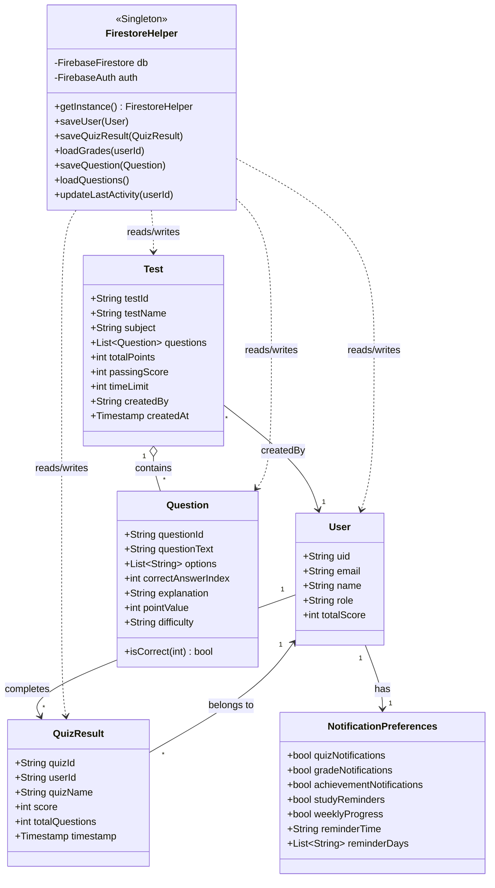

### תרשים קשרי רכיבים (Component Diagram)

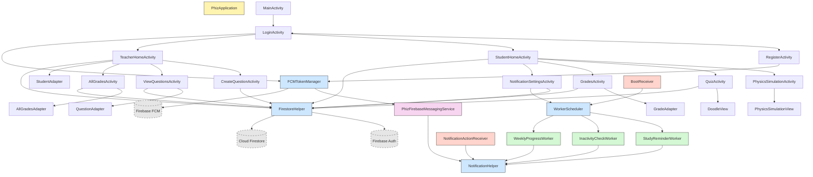

### עיקרי הקשרים

- **כל `User`** מזוהה לפי `uid` ובעל `role` יחיד ("student" או "teacher").
- **כל `User` (תלמיד)** יכול ליצור מספר רשומות `QuizResult`.
- **כל `QuizResult`** קשור ל-`User` יחיד דרך `userId` ולמבחן שבוצע.
- **כל `Test`** מכיל רשימה של `Question` ונוצר על ידי `User` מסוג מורה (`createdBy`).
- **כל `Question`** עומדת בפני עצמה במאגר וניתן לשייכה למספר מבחנים.
- **`NotificationPreferences`** משויך ל-`User` יחיד ומשפיע על ה-`Workers`.
- **מחלקת `FirestoreHelper`** היא נקודת הגישה היחידה לכל פעולות מסד הנתונים – היא מטפלת בשמירה, שליפה ומחיקה של כל הישויות.
- **מחלקות ה-`Adapter`** מחברות בין הנתונים (Models) לבין ממשק המשתמש (`RecyclerView`).
- **מחלקות ה-`Workers`** פועלות ברקע ותלויות ב-`NotificationPreferences` ו-`NotificationHelper` להצגת התראות.
- **`PhysicsSimulationView`** עצמאית ואינה קשורה ל-Firebase – כל החישובים מקומיים.

---

## 5. תיאור מבנה הנתונים ב-Firebase

### Firebase Authentication

משמש עבור:
- הרשמה (`createUserWithEmailAndPassword`)
- התחברות (`signInWithEmailAndPassword`)
- זיהוי משתמש קיים (`getCurrentUser`)
- ניתוק (`signOut`)

### Firestore – מבנה האוספים

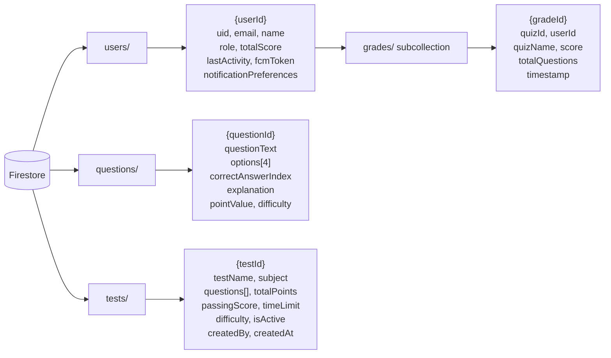

### Firebase Cloud Messaging (FCM)

משמש עבור:
- שליחת התראות Push מהשרת לאפליקציה
- שמירת ה-token של כל מכשיר תחת המשתמש

---

## 6. הסבר כללי על הארכיטקטורה

האפליקציה בנויה כך שיש הפרדה ברורה בין שכבות הקוד:

- **ממשק המשתמש (UI):** `Activities` + `Custom Views` (`PhysicsSimulationView`, `DoodleView`) + `Layouts` ב-XML + `Material Components`.
- **הנתונים (Models):** מחלקות `User`, `Question`, `Test`, `QuizResult`, `NotificationPreferences`.
- **שכבת העזר (Helpers):** `FirestoreHelper`, `NotificationHelper`, `FCMTokenManager`, `WorkerScheduler` – מנתקות את ה-Activities מהפרטים הטכניים של Firebase.
- **ניהול הנתונים בענן:** Firebase Authentication + Firestore + FCM.
- **משימות רקע:** `WorkManager` עם `Workers` שונים, ו-`BroadcastReceivers` לטיפול באירועי מערכת.
- **חיבור בין הנתונים למסכים:** מחלקות `Adapter` פנימיות בכל מסך עם רשימה.

מבנה זה מאפשר:

- **סדר וארגון בקוד** – כל סוג לוגיקה במקום מוגדר.
- **תחזוקה נוחה יותר** – שינויים במסד הנתונים מתבצעים במקום אחד (`FirestoreHelper`).
- **הפרדה בין תצוגה ללוגיקה** – המסכים אינם מבצעים פעולות ישירות מול Firestore.
- **הוספת תכונות חדשות בעתיד** – ניתן להוסיף Activities, Workers ומודלים חדשים מבלי לשבור את המבנה הקיים.
- **התאמה לשתי קבוצות משתמשים שונות** – תלמידים ומורים – באמצעות מנגנון תפקידים.
