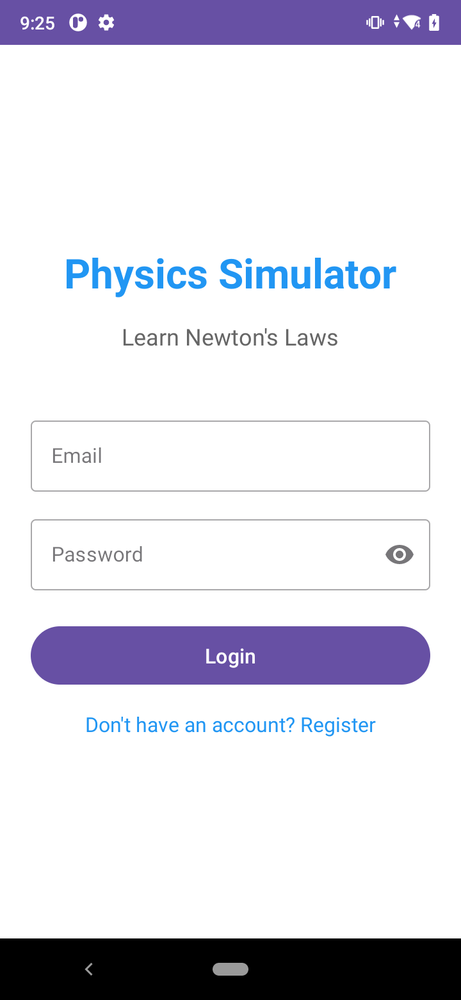
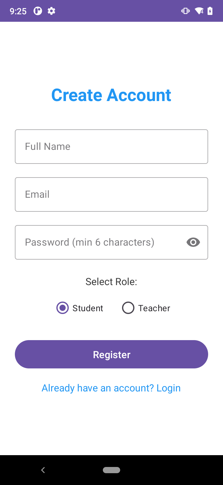
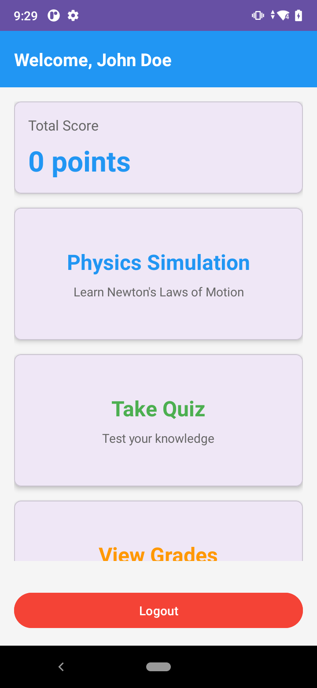
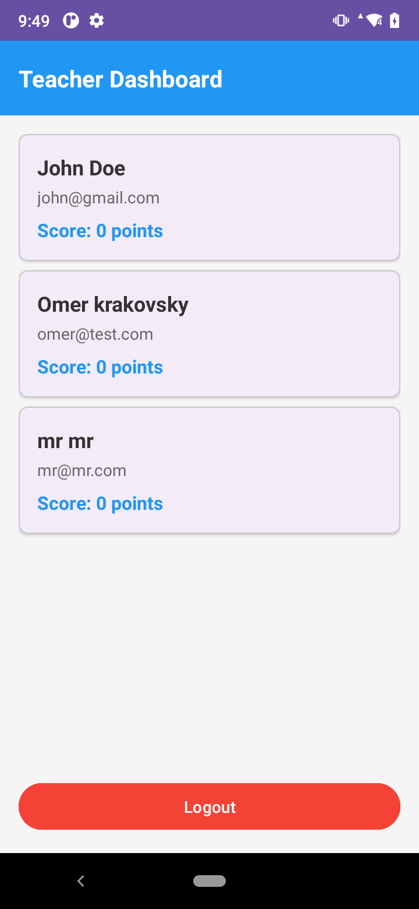
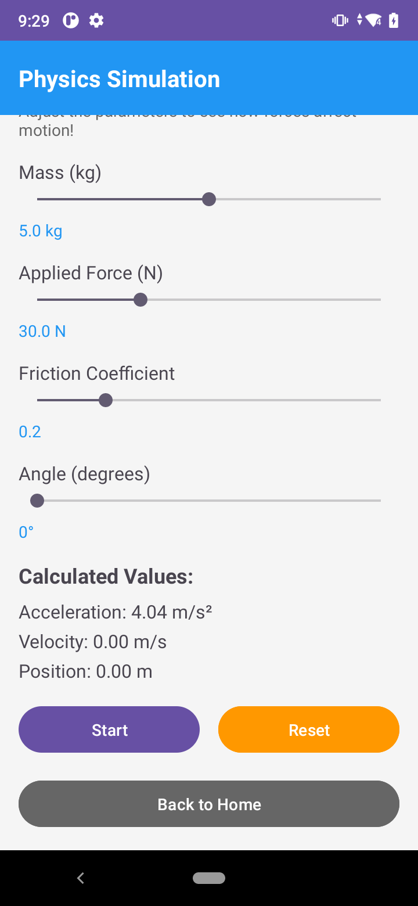
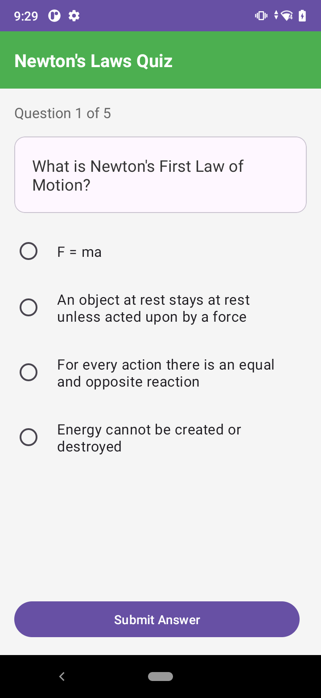
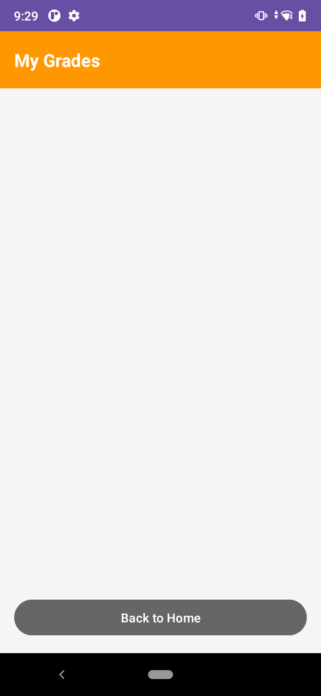

# מדריך למשתמש - אפליקציית סימולטור פיזיקה

## תוכן עניינים
1. [מבוא](#מבוא)
2. [מסך התחברות](#1-מסך-התחברות)
3. [מסך הרשמה](#2-מסך-הרשמה)
4. [מסך ראשי - תלמיד](#3-מסך-ראשי---תלמיד)
5. [מסך ראשי - מורה](#4-מסך-ראשי---מורה)
6. [מסך סימולציות פיזיקה](#5-מסך-סימולציות-פיזיקה)
7. [מסך בחן](#6-מסך-בחן)
8. [מסך ציונים](#7-מסך-ציונים)

---

## מבוא

**אפליקציית סימולטור פיזיקה** היא כלי חינוכי ללימוד חוקי תנועה של ניוטון באמצעות סימולציות אינטראקטיביות ובחנים.

**קהל יעד:**
- תלמידים - לומדים פיזיקה באמצעות סימולציות ובחנים
- מורים - עוקבים אחר הישגי התלמידים

**דרישות מערכת:**
- מכשיר Android גרסה 5.0 ומעלה
- חיבור לאינטרנט (לאימות ושמירת נתונים)

---

## 1. מסך התחברות

### מטרת המסך:
לאפשר למשתמשים רשומים להיכנס לאפליקציה.

### איך זה נראה:
המסך כולל:
- כותרת "Physics Simulator" בצבע כחול
- תת-כותרת "Learn Newton's Laws"
- שדה הזנה לכתובת אימייל
- שדה הזנה לסיסמה (עם אפשרות להציג/להסתיר את הסיסמה)
- כפתור "Login"
- קישור "Don't have an account? Register" למעבר להרשמה

### פעולות אפשריות:
1. הקלדת כתובת אימייל
2. הקלדת סיסמה
3. לחיצה על סמל העין להצגת/הסתרת הסיסמה
4. לחיצה על כפתור "Login" להתחברות
5. לחיצה על הקישור למעבר למסך הרשמה

### תוצאה צפויה:
- **אם הפרטים תקינים:** מעבר אוטומטי למסך הראשי המתאים (תלמיד או מורה)
- **אם השדות ריקים:** הודעת שגיאה "Please fill all fields"
- **אם הפרטים שגויים:** הודעת שגיאה "Login failed" עם הסבר

### 📷 תמונת מסך:

> **הערה:** במהלך ההתחברות מוצג אינדיקטור טעינה, והכפתור נחסם למניעת לחיצה כפולה.

---

## 2. מסך הרשמה

### מטרת המסך:
לאפשר למשתמשים חדשים ליצור חשבון באפליקציה.

### איך זה נראה:
המסך כולל:
- כותרת "Create Account" בצבע כחול
- שדה הזנה לשם מלא
- שדה הזנה לכתובת אימייל
- שדה הזנה לסיסמה (מינימום 6 תווים)
- בחירת תפקיד: תלמיד (Student) או מורה (Teacher)
- כפתור "Register"
- קישור "Already have an account? Login"

### פעולות אפשריות:
1. הקלדת שם מלא
2. הקלדת כתובת אימייל
3. הקלדת סיסמה (מינימום 6 תווים)
4. בחירת תפקיד - תלמיד או מורה
5. לחיצה על כפתור "Register"
6. לחיצה על הקישור למעבר להתחברות

### תוצאה צפויה:
- **אם ההרשמה הצליחה:** הודעה "Registration successful!" ומעבר למסך המתאים
- **אם השדות ריקים:** הודעה "Please fill all fields"
- **אם הסיסמה קצרה מדי:** הודעה "Password must be at least 6 characters"
- **אם האימייל כבר קיים:** הודעת שגיאה מתאימה

### 📷 תמונת מסך:

> **טיפ:** ברירת המחדל היא "Student". אם אתם מורים, אל תשכחו לסמן "Teacher" לפני ההרשמה!

---

## 3. מסך ראשי - תלמיד

### מטרת המסך:
מרכז השליטה של התלמיד - גישה לכל הפונקציות של האפליקציה.

### איך זה נראה:
המסך כולל:
- **סרגל עליון כחול** עם שם המשתמש: "Welcome, [שם]"
- **כרטיס ניקוד** - מציג את הניקוד הכולל שצברת
- **שלושה כרטיסים גדולים:**
  - **Physics Simulation** (כחול) - סימולציות פיזיקה
  - **Take Quiz** (ירוק) - ביצוע בחן
  - **View Grades** (כתום) - צפייה בציונים
- **כפתור Logout** (אדום) בתחתית המסך

### פעולות אפשריות:
1. **לחיצה על "Physics Simulation"** - מעבר למסך הסימולציות
2. **לחיצה על "Take Quiz"** - מעבר למסך הבחן
3. **לחיצה על "View Grades"** - מעבר למסך הציונים
4. **לחיצה על "Logout"** - התנתקות וחזרה למסך ההתחברות

### תוצאה צפויה:
- כל כרטיס מוביל למסך המתאים
- הניקוד מתעדכן אוטומטית לאחר ביצוע בחנים
- ההתנתקות מחזירה אותך למסך ההתחברות

### 📷 תמונת מסך:

> **טיפ:** הניקוד הכולל מחושב על סמך כל הבחנים שביצעת. ככל שתעשה יותר בחנים בהצלחה, הניקוד יעלה!

---

## 4. מסך ראשי - מורה

### מטרת המסך:
לאפשר למורה לצפות בכל התלמידים ובציוניהם.

### איך זה נראה:
המסך כולל:
- **סרגל עליון כחול** עם הכיתוב "Teacher Dashboard"
- **רשימה של כל התלמידים** - כל פריט מציג:
  - שם התלמיד
  - כתובת אימייל
  - ניקוד כולל
- **כפתור Logout** בתחתית המסך

### פעולות אפשריות:
1. גלילה ברשימת התלמידים
2. צפייה בפרטי כל תלמיד
3. לחיצה על "Logout" להתנתקות

### תוצאה צפויה:
- **אם יש תלמידים:** רשימה מלאה עם כל הפרטים
- **אם אין תלמידים:** הודעה "No students yet" במרכז המסך

### 📷 תמונת מסך:

> **הערה:** המורה יכול לראות רק את הנתונים הכלליים. אין אפשרות לערוך או למחוק תלמידים מהמסך הזה.

---

## 5. מסך סימולציות פיזיקה

### מטרת המסך:
ללמוד את חוקי ניוטון באופן אינטראקטיבי על ידי התאמת פרמטרים וצפייה בתנועה.

### איך זה נראה:
המסך כולל:
- **אזור סימולציה** בחלק העליון - מציג את האובייקט בתנועה
- **4 סרגלי התאמה (Sliders):**
  - **Mass (kg)** - מסה בקילוגרם (0-10 ק"ג)
  - **Applied Force (N)** - כוח מופעל בניוטון (0-100 N)
  - **Friction Coefficient** - מקדם חיכוך (0-1)
  - **Angle (degrees)** - זווית (0-45 מעלות)
- **ערכים מחושבים:**
  - תאוצה (Acceleration)
  - מהירות (Velocity)
  - מיקום (Position)
- **שלושה כפתורים:**
  - **Start** - התחלת הסימולציה
  - **Reset** (כתום) - איפוס הסימולציה
  - **Back to Home** (אפור) - חזרה למסך הראשי

### פעולות אפשריות:
1. **התאמת פרמטרים:**
   - גרירת הסרגלים לשינוי המסה, הכוח, החיכוך והזווית
   - הערכים מתעדכנים בזמן אמת
2. **הפעלת הסימולציה:**
   - לחיצה על "Start" מתחילה את התנועה
   - צפייה באובייקט נע על המסך
   - הערכים המחושבים משתנים בזמן אמת
3. **איפוס:**
   - לחיצה על "Reset" מחזירה הכל למצב התחלתי
4. **חזרה:**
   - לחיצה על "Back to Home" חוזרת למסך הראשי

### תוצאה צפויה:
- השינוי בפרמטרים משפיע ישירות על התנועה
- ניתן לראות כיצד כוח, מסה וחיכוך משפיעים על התאוצה והמהירות
- הסימולציה מדגימה את חוק ניוטון השני: F = ma

### 📷 תמונת מסך:

> **למידה פעילה:** נסו להגדיל את המסה - מה קורה לתאוצה? נסו להוסיף חיכוך - מה קורה למהירות?

---

## 6. מסך בחן

### מטרת המסך:
לבדוק את הידע שלך בחוקי ניוטון באמצעות בחן אינטראקטיבי.

### איך זה נראה:
המסך כולל:
- **סרגל עליון ירוק** עם הכיתוב "Newton's Laws Quiz"
- **מונה שאלות** - "Question X of 5"
- **כרטיס שאלה** עם טקסט השאלה
- **4 אפשרויות תשובה** (Radio buttons)
- **אזור משוב** - מופיע אחרי השליחה (ירוק לנכון, אדום לשגוי)
- **כפתורים:**
  - **Submit Answer** - שליחת התשובה
  - **Next Question** - מעבר לשאלה הבאה (מופיע רק אחרי שליחה)

### פעולות אפשריות:

#### בכל שאלה:
1. קריאת השאלה
2. בחירת תשובה אחת מתוך 4 אפשרויות
3. לחיצה על "Submit Answer"
4. קבלת משוב מיידי:
   - **תשובה נכונה:** הודעה ירוקה "Correct! Well done!"
   - **תשובה שגויה:** הודעה אדומה עם התשובה הנכונה
5. לחיצה על "Next Question" למעבר לשאלה הבאה

#### בסיום הבחן:
- **חלונית סיכום** מופיעה עם הציון הסופי
- **שתי אפשרויות:**
  1. "View Grades" - מעבר למסך הציונים
  2. "Back to Home" - חזרה למסך הראשי

### תוצאה צפויה:
- הבחן כולל 5 שאלות
- כל תשובה נכונה מזכה ב-20 נקודות
- הציון הסופי נשמר במערכת
- הניקוד הכולל מתעדכן במסך הראשי

### 📷 תמונת מסך:

**שאלה בבחן:**

> **הערה:** תמונות מסך נוספות (משוב נכון וסיכום הבחן) יתווספו בהמשך.

> **חשוב:** לא ניתן לחזור לשאלות קודמות. וודאו שאתם בטוחים בתשובה לפני השליחה!

---

## 7. מסך ציונים

### מטרת המסך:
לצפות בכל הבחנים שביצעת ובציונים שקיבלת.

### איך זה נראה:
המסך כולל:
- **סרגל עליון כתום** עם הכיתוב "My Grades"
- **רשימת ציונים** - כל פריט מציג:
  - שם הבחן: "Newton's Laws Quiz"
  - תאריך ושעה: "Dec 23, 2025 14:30"
  - ציון: "Score: 80/100"
  - אחוזים: "80%"
- **כפתור "Back to Home"** בתחתית

### פעולות אפשריות:
1. גלילה ברשימת הציונים (מהחדש לישן)
2. צפייה בכל הבחנים שביצעת
3. לחיצה על "Back to Home" לחזרה למסך הראשי

### תוצאה צפויה:
- **אם יש ציונים:** רשימה מלאה ממוינת לפי תאריך (החדש ביותר למעלה)
- **אם אין ציונים:** הודעה "No quiz results yet. Take a quiz to see your grades!"

### 📷 תמונת מסך:

**מסך ריק (אין עדיין ציונים):**

> **הערה:** תמונת מסך של רשימת ציונים עם נתונים תתווסף בהמשך.

> **טיפ:** הציונים נשמרים לצמיתות. אפשר לעשות את אותו הבחן מספר פעמים לשיפור הציון!

---

## שאלות נפוצות (FAQ)

### שאלות כלליות

**ש: האם צריך חיבור לאינטרנט?**
ת: כן, לצורך התחברות, הרשמה ושמירת ציונים. הסימולציות עובדות גם ללא אינטרנט.

**ש: האם אפשר לשנות את התפקיד (תלמיד/מורה)?**
ת: לא, התפקיד נקבע בהרשמה ולא ניתן לשנות אותו.

**ש: מה קורה אם שכחתי את הסיסמה?**
ת: כרגע אין אפשרות לאיפוס סיסמה. פנו לתמיכה טכנית.

### שאלות על בחנים

**ש: כמה פעמים אפשר לעשות בחן?**
ת: אין הגבלה! אפשר לחזור ולעשות בחנים כמה שרוצים.

**ש: איך מחושב הניקוד הכולל?**
ת: הניקוד הכולל הוא סכום כל הבחנים שעשית.

**ש: אפשר לראות את השאלות בבחן לפני שמתחילים?**
ת: לא, השאלות מוצגות אחת אחת במהלך הבחן.

### שאלות על סימולציות

**ש: איך יודעים מה כל פרמטר עושה?**
ת: נסו לשנות כל פרמטר בנפרד וצפו בהשפעה על התנועה.

**ש: הסימולציה לא עוצרת. מה עושים?**
ת: לחצו על כפתור "Reset" לאיפוס הסימולציה.

---

## טיפים לשימוש יעיל

### לתלמידים:

1. **התחילו מהסימולציות**
   - הבינו את המושגים בצורה ויזואלית לפני הבחן
   - נסו להבין את הקשר בין כוח, מסה ותאוצה

2. **עשו את הבחן מספר פעמים**
   - ניסיון ראשון - למידה
   - ניסיונות נוספים - שיפור הציון

3. **עקבו אחר ההתקדמות**
   - בדקו את מסך הציונים באופן קבוע
   - השוו בין הבחנים השונים

### למורים:

1. **בדקו את מסך התלמידים באופן קבוע**
   - זהו תלמידים שצריכים עזרה
   - עקבו אחר התקדמות הכיתה

2. **עודדו שימוש בסימולציות**
   - הסימולציות הן כלי למידה חזק
   - תלמידים שמשתמשים בהן משיגים ציונים טובים יותר

---

## פתרון בעיות נפוצות

### בעיית התחברות

**תסמין:** "Login failed" או "User data not found"

**פתרונות:**
1. ודאו שכתובת האימייל והסיסמה נכונים
2. ודאו שהחשבון נוצר (עברו הרשמה)
3. בדקו את חיבור האינטרנט
4. נסו להתנתק ולהתחבר שוב

### בעיית טעינת נתונים

**תסמין:** "Error loading data"

**פתרונות:**
1. בדקו חיבור לאינטרנט
2. סגרו ופתחו מחדש את האפליקציה
3. התנתקו והתחברו מחדש

### בעיית שמירת ציונים

**תסמין:** "Error saving results"

**פתרונות:**
1. ודאו שיש חיבור לאינטרנט בזמן סיום הבחן
2. נסו לעשות את הבחן שוב

### הסימולציה לא עובדת

**תסמין:** לא רואים תנועה או הערכים לא משתנים

**פתרונות:**
1. לחצו על "Reset"
2. בדקו שהכוח והמסה לא אפס
3. סגרו ופתחו מחדש את מסך הסימולציה

---

## יצירת קשר ותמיכה

אם נתקלתם בבעיה שלא מופיעה במדריך:

- **דווחו על תקלות:** היכנסו ל-[GitHub Issues](https://github.com/username/phiz/issues)
- **הצעות לשיפור:** שלחו משוב דרך GitHub

---

## סיכום

אפליקציית סימולטור פיזיקה מציעה דרך מהנה ואינטראקטיבית ללמוד פיזיקה:

✅ **סימולציות חזותיות** - הבנת המושגים בצורה ויזואלית
✅ **בחנים אינטראקטיביים** - בדיקת הידע עם משוב מיידי
✅ **מעקב אחר התקדמות** - צפייה בציונים ובשיפור
✅ **ממשק ידידותי** - קל לשימוש עם הוראות ברורות

**בהצלחה בלימודים!** 🚀
